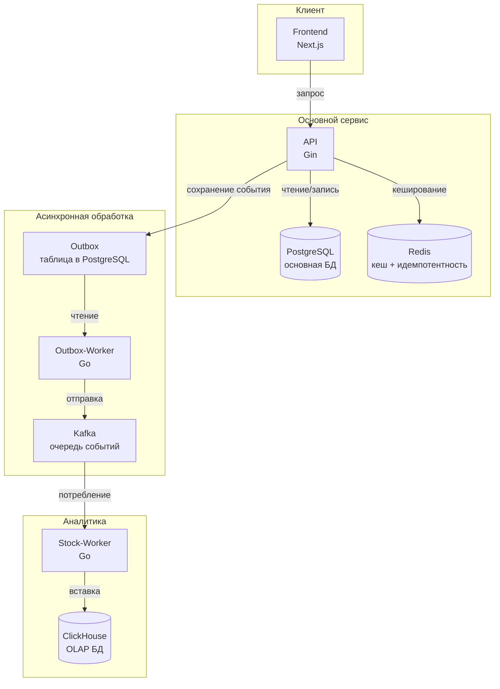

# Inventory Management System

**Inventory Management System** — высоконагруженная микросервисная платформа для резервирования товаров с асинхронной обработкой событий через Kafka, гарантированной доставкой через Outbox, распределённой трассировкой и мониторингом в реальном времени.

---

## Особенности

- **Микросервисная архитектура**: API, outbox-worker, stock-worker.
- **Outbox pattern** — гарантированная доставка событий в Kafka.
- **WebSocket** — real‑time обновления списка резервирований.
- **Circuit Breaker** — защита от падений Kafka.
- **Пул воркеров** — параллельная обработка сообщений.
- **Распределённая трассировка** — Jaeger (OpenTelemetry).
- **Метрики** — Prometheus + Grafana.
- **Логи** — Loki + Grafana (централизованный сбор).
- **Нагрузочное тестирование** — k6.
- **CI/CD** — GitHub Actions.
- **Docker Compose** и **Kubernetes** манифесты.

---

## Технологический стек

| Компонент       | Технология |
|-----------------|------------|
| **Язык**        | Go         |
| **API**         | Gin         |
| **БД**          | PostgreSQL  |
| **Аналитика**   | ClickHouse  |
| **Кеш**         | Redis       |
| **Очередь**     | Kafka       |
| **Трассировка** | Jaeger      |
| **Метрики**     | Prometheus + Grafana |
| **Логи**        | Loki + Promtail |
| **Тестирование**| k6, testify, sqlmock |
| **Оркестрация** | Docker Compose, Kubernetes |

---

## Архитектура



Полная цепочка запроса:  
`Frontend → API → PostgreSQL → Outbox → Outbox-Worker → Kafka → Stock-Worker → ClickHouse`

---

## Быстрый старт (Docker Compose)

1. Клонируйте репозиторий
```bash
git clone https://github.com/I000000/InventoryManagement.git
cd InventoryManagement
```
2. Скопируйте файл с переменными окружения и заполните его
```bash
cp .env.example  .env
```
3. Соберите Docker-образы
```bash
make build
```
4. Запустите систему
```bash
make start
```
5. Проверьте работу
-   **API**: [http://localhost:8080/health](http://localhost:8080/health)
-   **Фронтенд**: [http://localhost:3001](http://localhost:3001/)
-   **Grafana**: [http://localhost:3000](http://localhost:3000/) (admin/admin)
-   **Jaeger**: [http://localhost:16686](http://localhost:16686/)

---

## Kubernetes
1. Скопируйте файл с секретами и заполните его
```bash
cp secrets.example.yaml k8s/secrets.yaml
```
2. Примените все манифесты
```bash
make k8s-apply
```
3. Проверьте статус подов
```bash
make k8s-status
```
4. После того как все поды перешли в статус `Running`, примените миграции
```bash
make k8s-migrate
```
5. Откройте доступ к сервисам
```bash
make k8s-port-forward-api
make k8s-port-forward-frontend
make k8s-port-forward-jaeger
```
> Каждая команда запускается в отдельном терминале.

---

## Тестирование

Юнит-тесты
```bash
cd backend
go test  -v  ./...
```
Нагрузочное тестирование
```bash
make loadtest
```
Результаты нагрузочного тестирования
| Метрика           | Значение |
|-------------------|----------|
| **RPS**           | ~360     |
| **p95 latency**   | ~12 ms   |
| **Среднее время** | ~5 ms    |
| **Ошибки**        | 0%       |
> Тестирование проводилось с **80 виртуальными пользователями** на протяжении **2 минут** на машине 6 ядер, 16GB RAM, SSD. На Вашем оборудовании результаты могут быть другими.
